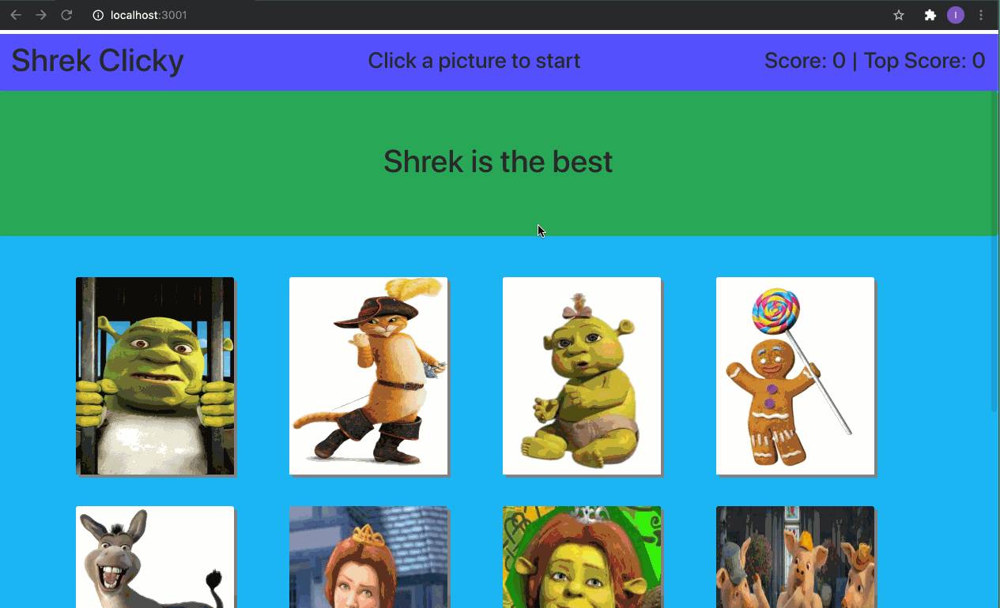

# Shrek Game 


## Table of Contents
* [Description](#Description)
* [Technologies](#Technologies)
* [Features](#Features)
* [Code](#Code)
* [Author](#Author)
* [Credits](#Credits)
* [License](#License)

## Description 


## Technologies
* [JavaScript](https://www.w3schools.com/js/)
* [Bootstrap](https://getbootstrap.com/)
* [React](https://reactjs.org/)
* [ReactDom](https://reactjs.org/docs/react-dom.html)


## Features


# Code

## App.js

*  Here I am setting a state for the score, characters and a starting message. I also made a function to handle the click which randomizes the images, sets a new state to the score when ever it's clicked. This function will be called in our form below. 
```
 state = {
    // THIS IS STORING ALL MY JSON FILE 
    Characters: Characters,
    score: 0,
    highScore: 0,
    message: "Click a picture to start"
  };


  handleClick = (event) => {
    console.log(event.target);
    const currentId = event.target.getAttribute("data-id");

    console.log(hasBeenClicked);

this.setState({message: "Let's play"})

if (!hasBeenClicked.includes(currentId)) {
  hasBeenClicked.push(currentId)
  const newCount = this.state.score + 1;
  // const highScoreCount = this.state.highScore +1;
  this.setState({score: newCount});
  this.setState({message: "Nice!"})
  if (newCount > this.state.highScore) {
    this.setState({highScore: newCount})
  }
} else {
  this.setState({score: 0});
  this.setState({message: "Wrong Buddy!"})
  hasBeenClicked = [];


}

      // Shuffles the array of characters
      const arr = this.state.Characters;
      for (let i = arr.length - 1; i > 0; i--) {
        let j = Math.floor(Math.random() * arr.length);
        let temp = arr[i];
        arr[i] = arr[j];
        arr[j] = temp;
      }
      this.setState({ Characters: arr });
  };


  ```

## App.js Continue
* Here we have our form. This form was created in the components folder and was given some props. We took those props here and gave them values. 

```

  render() {
    return (
      <Wrapper>
        <NavBar
        score = {this.state.score}
        topScore ={this.state.highScore}
        message={this.state.message}
        />
        <Jumbo />
        <div className="container">
          <div className="row">
        {this.state.Characters.map((character) => (
          <Card
            key={character.id}
            imageURL={character.image}
            id={character.id}
            alt={character.name}
            handleClick={this.handleClick}
         
          />
          
        ))}
</div>
</div>
      </Wrapper>
    );
  }

```


## Author
Ivan Torres
* [GitHub-Repo]()
* [linkedIn](www.linkedin.com/in/ivan-torres-0828931b2)
* [Portfolio](https://ivantorresmia.github.io/IvanTorres-portfolio/)
* [Deployed-Link]()

## Credits
* Credits for this homework assignment go out to Jerome, Manuel, Kerwin, Roger, and all of my classmates who helped me in study sessions. As well as my tutor who helped me a ton with understanding this homework assignment. 
* [StackOverFlow](https://stackoverflow.com/)


## License]
[MIT](https://choosealicense.com/licenses/mit/#) license 